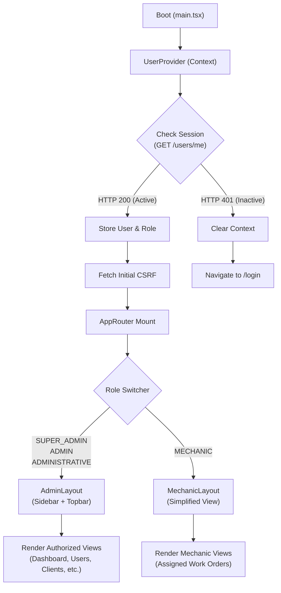
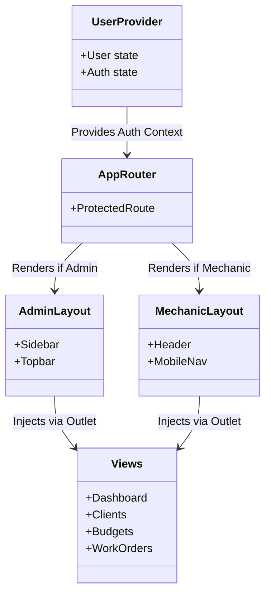
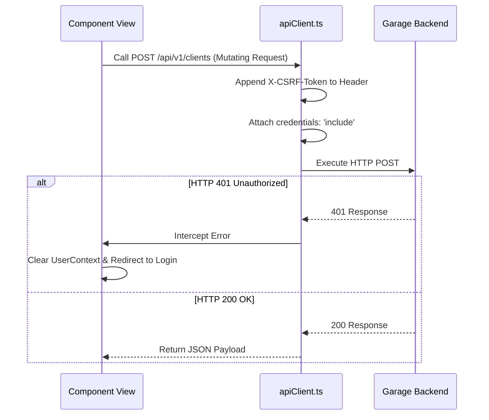

# 🖥️ Garage Manager Frontend

[](https://github.com/Cvidal84/garage-manager-frontend)
[](https://react.dev)
[](https://www.typescriptlang.org)
[](https://vitejs.dev)
[](https://web.dev/progressive-web-apps/)
[](#-license)

## 📋 Project Description

**garage-manager-frontend** is a production-ready, Progressive Web Application (PWA) designed as the client-side interface for our SaaS workshop management platform.
It is built as a Single Page Application (SPA) utilizing React, TypeScript, and Vite. The frontend consumes the `garage-manager-api` directly via REST endpoints, providing a multi-tenant, role-aware, and highly responsive user interface across both desktop and mobile platforms.

---

## ✨ Key Features

### 📱 Responsive PWA

Built entirely with Vanilla CSS leveraging modern CSS Variables, Flexbox, and Grid for a perfectly responsive experience. The app utilizes custom hooks (`useInstallPrompt`, `useOnlineStatus`) to allow native installation and handle network interruptions gracefully.

### 🔐 Secure Auth & CSRF Handling

Integrates seamlessly with the backend's strict security model. Manages `httpOnly` authentication cookies implicitly through a centralized `apiClient.ts` which intercepts and refreshes CSRF tokens dynamically for all mutating requests.

### 👥 Role-Based UI Context

The frontend dynamically adjusts layouts, navigation menus, and specific CRUD actions depending on the active user's role (`SUPER_ADMIN`, `ADMIN`, `ADMINISTRATIVE`, `MECHANIC`).

### 📊 Real-time Dashboard Analytics

Provides key business insights (monthly revenue, pending tasks, vehicle distribution) using `recharts` to render responsive and intuitive SVG data visualizations.

---

## 🛠️ Tech Stack

| Category       | Technology                 | Version         |
| -------------- | -------------------------- | --------------- |
| **Framework**  | React                      | 19.2.0          |
| **Language**   | TypeScript                 | 5.9.3           |
| **Build Tool** | Vite                       | 7.3.1           |
| **Routing**    | react-router-dom           | 7.13.1          |
| **Icons**      | lucide-react               | 0.575.0         |
| **Charts**     | recharts                   | 3.8.1           |
| **PWA Plugin** | vite-plugin-pwa            | 1.2.0           |
| **Styling**    | Vanilla CSS                | —               |
| **Linting**    | ESLint + typescript-eslint | 9.39.1 / 8.48.0 |

---

## 🏗️ Architecture

### Project Structure

```text
src/
├── assets/                     # Static images, icons, and SVG assets
├── components/                 # Reusable, stateless UI components (Modals, Tables, Forms)
├── context/                    # React Context providers (UserContext)
├── hooks/                      # Custom React hooks (useInstallPrompt, useOnlineStatus)
├── layouts/                    # Structural wrappers (AdminLayout, MechanicLayout)
├── pages/                      # Top-level standalone pages (Login, Dashboard, Profile)
├── router/                     # React Router configuration (AppRouter)
├── services/                   # API interaction layer (apiClient, custom endpoint modules)
├── styles/                     # Global CSS variables, resets, and utility classes
├── types/                      # Global TypeScript interfaces for API models
├── utils/                      # Helper functions (formatters, date parsers, validators)
├── views/                      # Feature-specific views (Budgets, Clients, Vehicles)
├── App.tsx                     # Main application wrapper
└── main.tsx                    # React DOM entry point
```

### Application Flow & Lifecycle

The lifecycle of the application follows a strict security-first pattern. Upon loading, the system queries the API to establish the active session, retrieves the CSRF token if necessary, and only then initializes the layout and routes.



---

## 🧩 Component & State Architecture

### UI Component Tree

The UI is divided into highly cohesive layouts that inject child views dynamically via `react-router-dom`'s `<Outlet />`.



---

## 🔐 Authentication & Session Management

The frontend relies completely on the backend's `httpOnly` cookie architecture. Tokens are never stored in `localStorage`, mitigating XSS risks.

### The `apiClient` Interceptor

All outgoing API calls pass through a centralized `apiClient.ts` wrapper. This ensures maximum security and uniformity:



**Key Responsibilities of `apiClient`:**

1. **Credentials Inclusion:** Enforces `credentials: 'include'` so browsers automatically send the `garage_auth` session cookie.
2. **CSRF Injection:** Retrieves the active CSRF token from the application state and injects it into headers for `POST`, `PUT`, `PATCH`, and `DELETE` requests.
3. **Error Normalization:** Standardizes API error payloads so UI components can display consistent Toast/Modal error messages.

---

## 🚦 Routing & Access Control Matrix

Access is governed by `AppRouter.tsx`, wrapping routes in a `ProtectedRoute` component. Views are restricted dynamically based on the session's role payload. If a user attempts to manually navigate to an unauthorized route, they are automatically redirected.

| View Component        | Route                  | SUPER_ADMIN | ADMIN | ADMINISTRATIVE | MECHANIC |
| --------------------- | ---------------------- | ----------- | ----- | -------------- | -------- |
| **Dashboard**         | `/app/inicio`          | ✅          | ✅    | ✅             | ❌       |
| **Profile**           | `/app/mi-perfil`       | ✅          | ✅    | ✅             | ✅       |
| **Companies**         | `/app/empresas`        | ✅          | ❌    | ❌             | ❌       |
| **Users**             | `/app/usuarios`        | ✅          | ✅    | ✅             | ❌       |
| **Clients**           | `/app/clientes`        | ❌          | ✅    | ✅             | ❌       |
| **Vehicles**          | `/app/vehiculos`       | ❌          | ✅    | ✅             | ❌       |
| **Budgets**           | `/app/presupuestos`    | ❌          | ✅    | ✅             | ❌       |
| **Work Orders (All)** | `/app/albaranes`       | ❌          | ✅    | ✅             | ❌       |
| **My Work Orders**    | `/app/ordenes-trabajo` | ❌          | ❌    | ❌             | ✅       |

---

## 🎨 UI & Styling System

The application intentionally avoids heavy UI libraries like Tailwind or Material UI to maintain absolute control over the DOM, drastically reducing bundle size and improving performance.

- **Vanilla CSS:** Styled entirely using native CSS.
- **CSS Variables:** Theming, color palettes, and spacing are driven by global CSS variables located in `src/index.css`.
- **BEM Methodology:** Components use strict BEM (Block Element Modifier) class naming conventions to prevent style bleeding.
- **Responsive Grids:** Complex forms and data tables utilize CSS Grid (`grid-template-columns`) for fluid responsiveness.

---

## ✅ Prerequisites

Before running the project locally, make sure you have the following:

| Requirement     | Version              | Notes                                         |
| --------------- | -------------------- | --------------------------------------------- |
| **Node.js**     | v18+ recommended     | —                                             |
| **npm**         | Bundled with Node.js | —                                             |
| **API Backend** | —                    | Requires `garage-manager-api` running locally |

### Environment Variables

Create a `.env` file in the project root with the following variables:

| Variable       | Required | Description                                                         |
| -------------- | -------- | ------------------------------------------------------------------- |
| `VITE_API_URL` | ✅ Yes   | Base URL for the backend API (e.g., `http://localhost:8080/api/v1`) |

### Example `.env`

```env
VITE_API_URL=http://localhost:8080/api/v1
```

---

## 🚀 Installation

### 1. Clone the repository

```bash
git clone https://github.com/Cvidal84/garage-manager-frontend.git
cd garage-manager-frontend
```

### 2. Install dependencies

```bash
npm install
```

### 3. Configure environment variables

Create a `.env` file in the project root (see the Environment Variables section).

### 4. Run the development server

```bash
npm run dev
```

> The server will start on `http://localhost:5173` by default.

### 5. Production build

```bash
npm run build   # Compiles TypeScript and builds for production via Vite
npm run preview # Previews the production build locally
```

### 6. Linting & Formatting

```bash
npm run lint          # Run ESLint
npm run lint:fix      # Run ESLint with auto-fix
npm run format        # Format all files with Prettier
```

---

## 📄 License

**© 2026 yriaforjan, Cvidal84 — All rights reserved.**

This software is proprietary. Unauthorized copying, distribution, or use of this codebase is strictly prohibited without explicit written permission from the authors.

---

## 👩🏼‍💻👨🏽‍💻 Authors

| Name                    | GitHub                                       |
| ----------------------- | -------------------------------------------- |
| Yria Forján Oliveira    | [@yriaforjan](https://github.com/yriaforjan) |
| Carlos Vidal Puigcerver | [@Cvidal84](https://github.com/Cvidal84)     |
